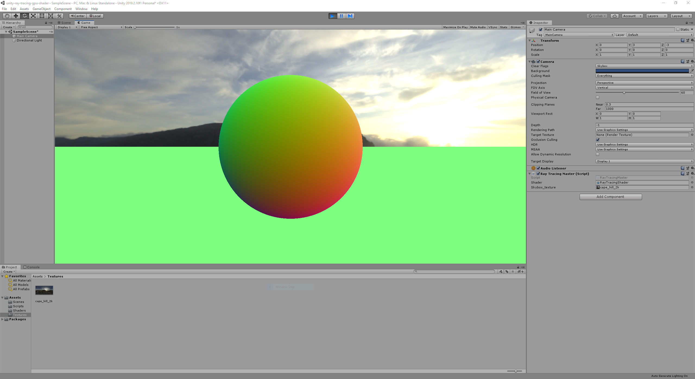
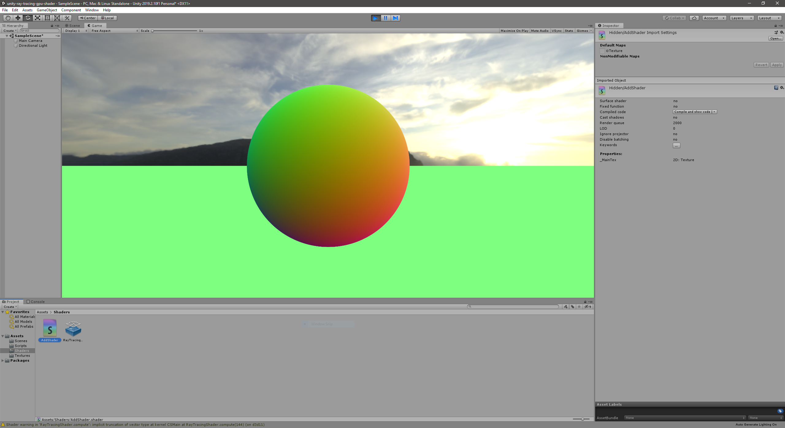
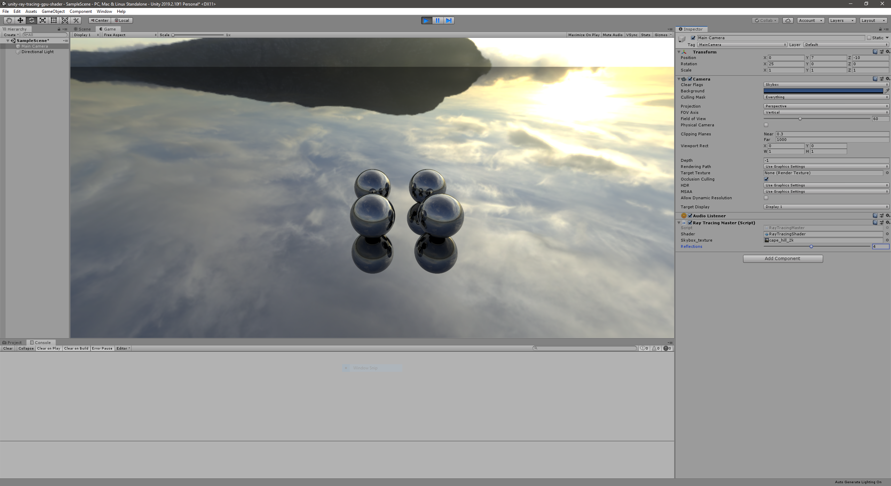

# Unity - GPU Ray Tracing in Unity

## About

This is a project to learn about Compute Shaders and Ray Tracing in Unity. I am following
the [great article](http://blog.three-eyed-games.com/2018/05/03/gpu-ray-tracing-in-unity-part-1/) by
David Kuri on the topic.

## Project Organization

Each stage of the project will be available as individual tag.

| Tag                        | Description                                                       |
| -------------------------- | ----------------------------------------------------------------- |
| 01-setup-raytracing-master | Create the controller script which invokes the compute shader.    |
| 02-sample-from-texture     | Create rays and sample from Skybox texture.                       |
| 03-trace-ground-and-sphere | Trace rays and intersect with ground plane and sphere.            |
| 04-progressive-sampling    | Progressive sampling to remove aliasing when camera doesn't move. |
| 05-mirror-reflection       | Mirror-like reflection for metalic objects by bouncing rays.      |

## 01-setup-raytracing-master

This is the output after setting up the `RayTracingMaster.cs` script to invoke Unity's default compute shader.

## 02-sample-from-texture

The output after creating rays and sampling from a Skybox texture:

## 03-trace-ground-and-sphere

The output after adding a ground plane and sphere. Nasty aliasing!

## 04-progressive-sampling

After progressive sampling, the sphere looks much better.

## 05-mirror-reflection

After adding bouncing rays for mirror-like reflections for metalic materials, we can see relections in
reflections in relections in ...

