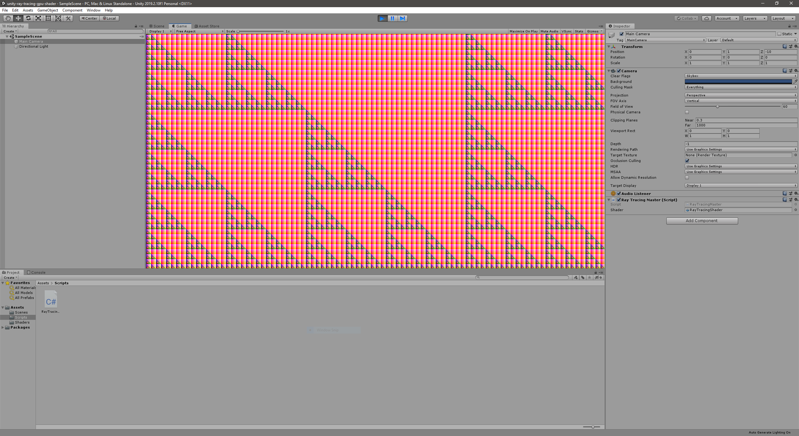
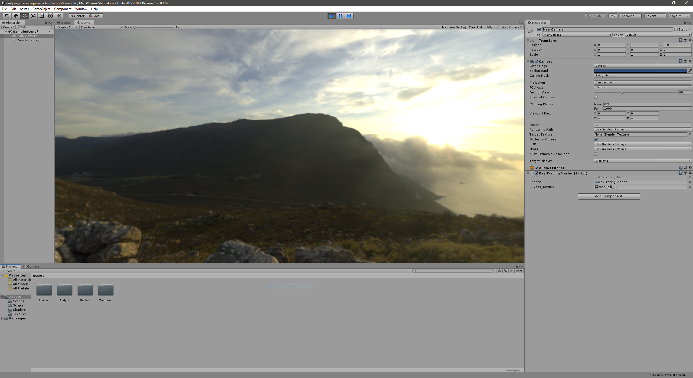

# Unity - GPU Ray Tracing in Unity

## About

This is a project to learn about Compute Shaders and Ray Tracing in Unity. I am following
the [great article](http://blog.three-eyed-games.com/2018/05/03/gpu-ray-tracing-in-unity-part-1/) by
David Kuri on the topic.

## Project Organization

Each stage of the project will be available as individual tag.

| Tag                        | Description                                                    |
| -------------------------- | -------------------------------------------------------------- |
| 01-setup-raytracing-master | Create the controller script which invokes the compute shader. |
| 02-sample-from-texture     | Create rays and sample from Skybox texture.                    |

## 01-setup-raytracing-master

This is the output after setting up the `RayTracingMaster.cs` script to invoke Unity's default compute shader.

## 02-sample-from-texture

The output after creating rays and sampling from a Skybox texture:

